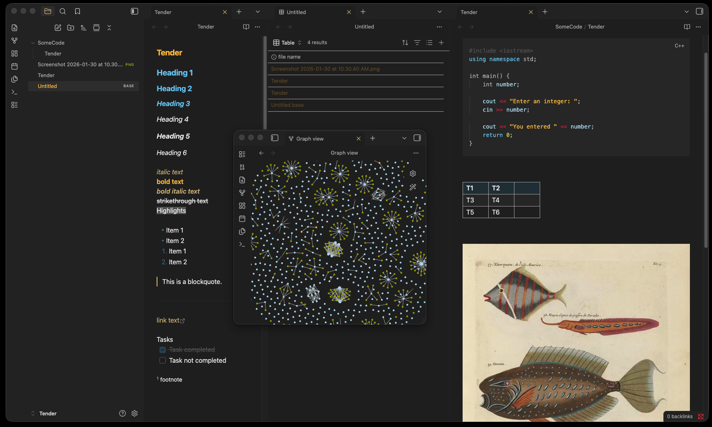

# Obsidian + Tender

Obsidian theme based on [tender.vim](https://github.com/jacoborus/tender.vim) by [Jacobo Tabernero](https://github.com/jacoborus).

Various mapping for code elements and color choices from [terminalcolors](https://terminalcolors.com/themes/tender/) and [this](https://marketplace.visualstudio.com/items?itemName=jmreicha.tender) vscode extension by [jmreicha](https://marketplace.visualstudio.com/publishers/jmreicha).

## Screenshots

## Features

- Like [gruvbox](https://github.com/morhetz/gruvbox) with less muted pallete.
- Soft contrast, but brighter colors for using devices on lower brightness settings.
- Syntax highlighting.

## Installation

Simply clone this repo into your vault directory/.obsidian/themes to choose it from your settings.

TODO:

- Language specific highlighting to match other extenstions.
- Create light scheme.
- Conditional colors for attachment types in sidebar and graph view.

## Contributing

- Fork this repo, detail changes, and submit a pull request.
